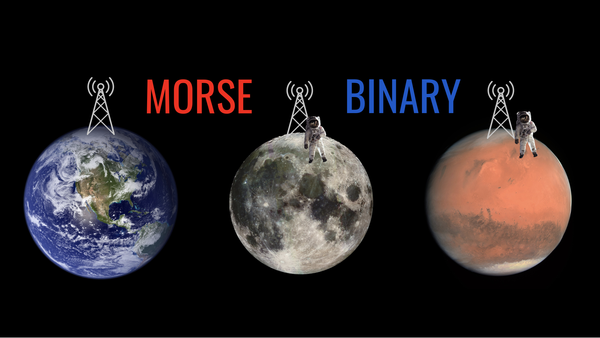
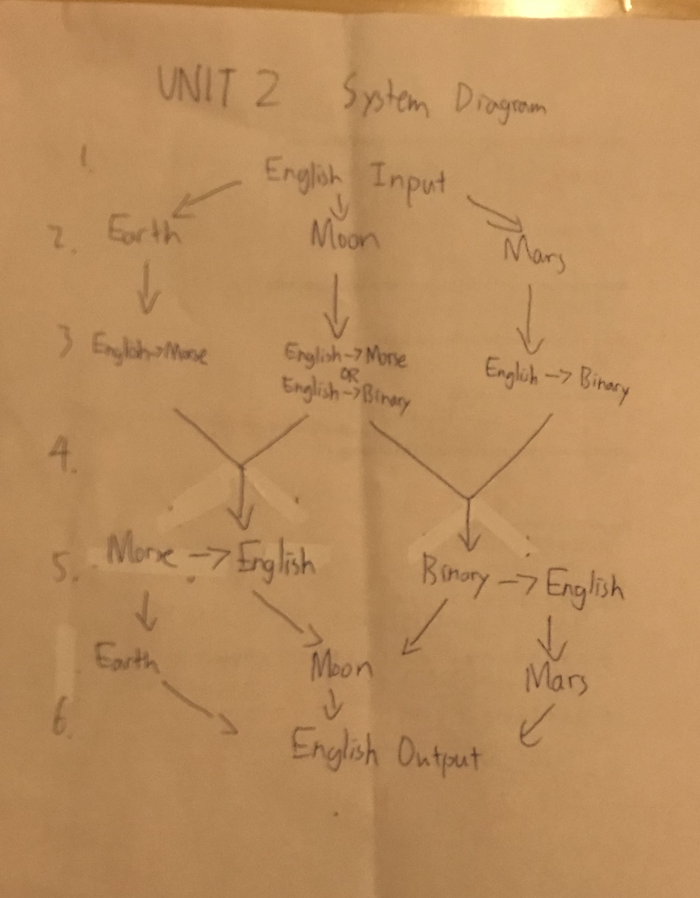
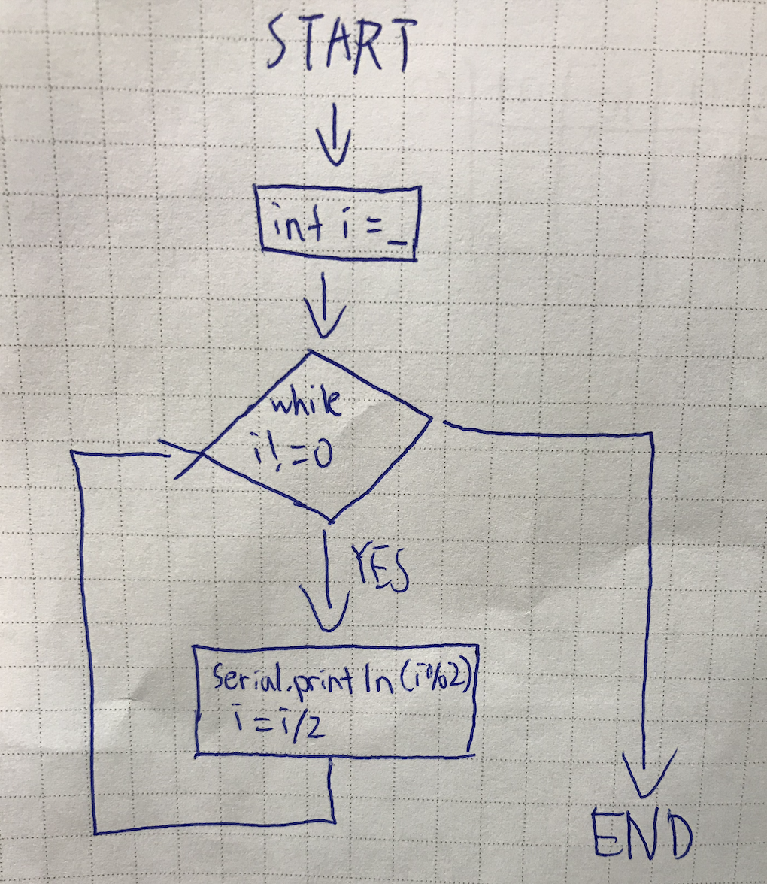
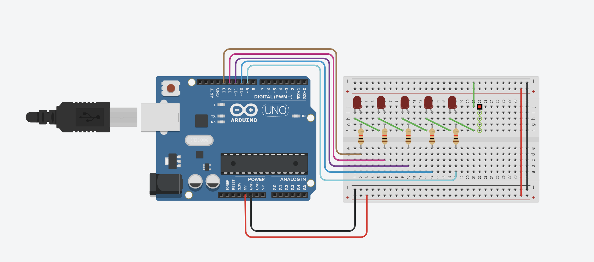
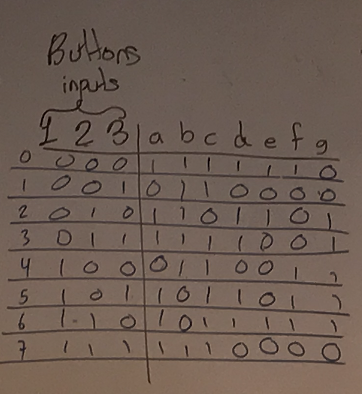
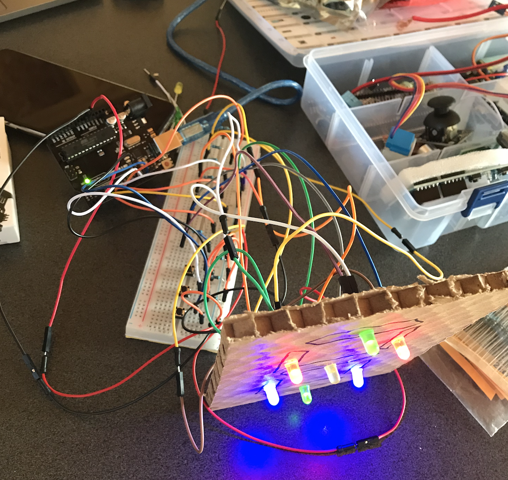
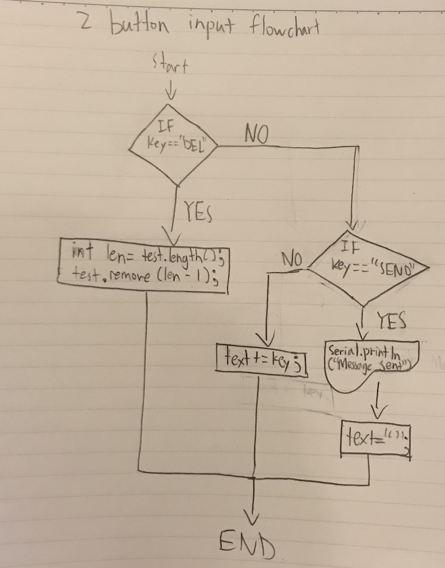
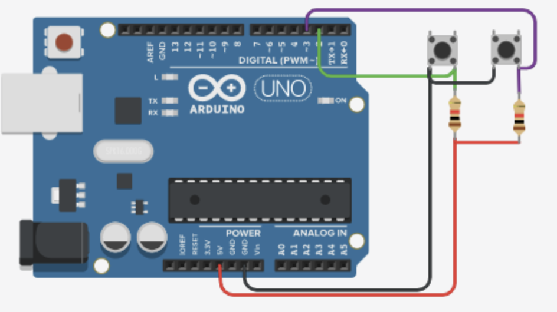
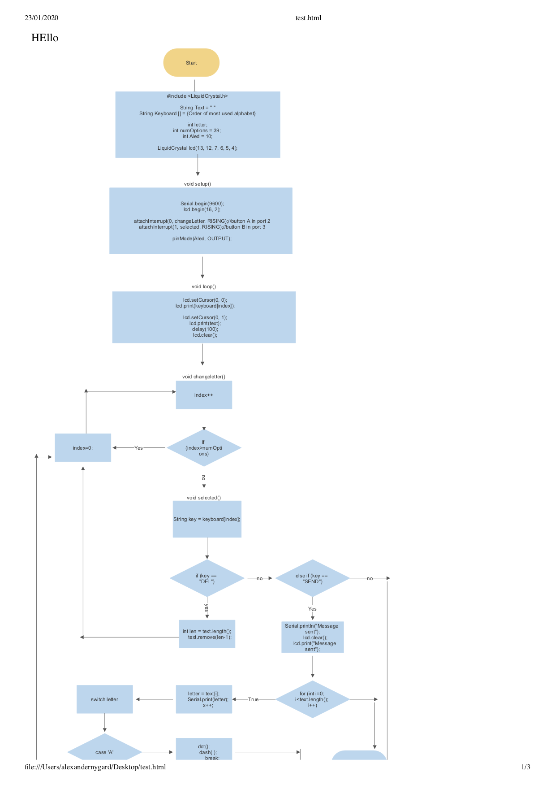
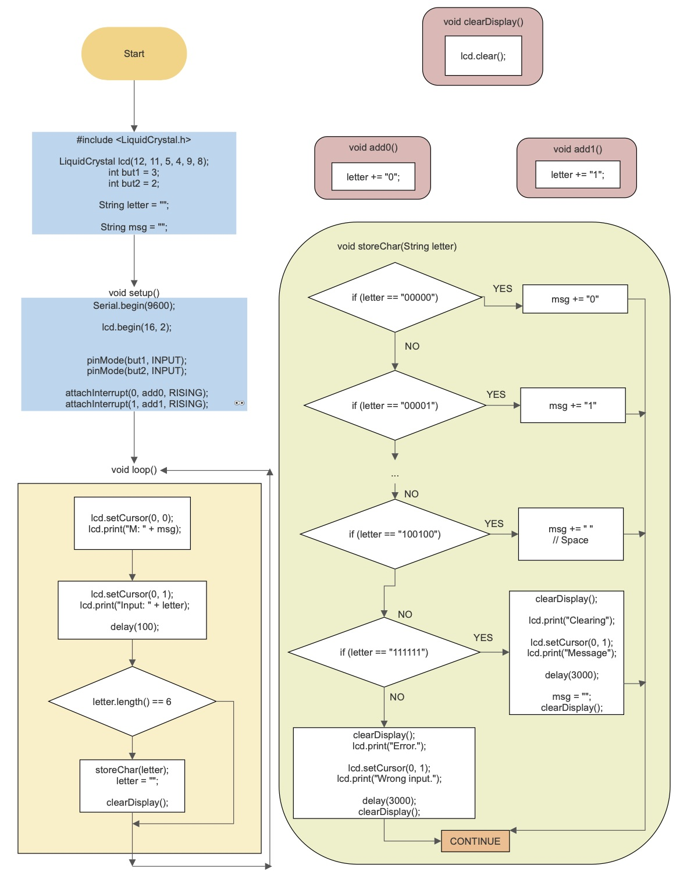

Unit 2 project: Communication to the Moon and Mars
==================================================

Creating a communication and translation software system to communicate between the Earth, Moon and Mars.


Contents
-----
  1. [Planning](#planning)
  1. [Design](#design)
  1. [Development](#development)
  1. [Evalution](#evaluation)
  1. [Improvements](#improvements)


Planning
----------
### Definition of the problem
There are 3 different stations, each being on a different planet/moon in the solar system. One is on Earth, one is on the Moon and the last one is on Mars. The station on Earth can only communicate using Morse code, the station in the Moon can only communicate in Binary code. Communication with the station in Mars must be provided. This will be tested here on campus, between 3 different houses.

Any station can only communicate in their "language". For example, the station on Mars must communicate back to the Moon through binary. Also, its important that the station on Earth **can't** communicate with the station on Mars, it had to go through the Moon.

Another challenge is that none of the people at the stations know morse or binary by heart, meaning everything has to be translated to and from English, and be received as English as well.

The last requirement of the system is that the input method of English characters to create the message only uses **2** push buttons. 

### Justification
**Bash vs. Arduino (C)**

Bash:

Pros
- Highly useful for scripting when running code directly from terminal to perform simple, repetitive jobs
- Gives users a lot of control over the system being used
- Widely adopted

Cons
- Unsatisfactory, complicated syntax
- Small mistakes of little relevance
- Can only run in specific environments, not including Arduino hardwares


Arduino (C):

Pros
- Industry standard, commonly used
- Lower level (closer to the computer hardware)
- Relatively simple
- Very optimized and fast

Cons
- Syntax-wise isn't as simple compared to other high level languages

Why I chose Arduino (C)
Both programming languages have their pros and cons, and it's hard to compare which one's better since they're used in different areas. When choosing the language for this project, the only option is Arduino (C), because it is the only option that meets the hardware requirements, functionality, and usability. Also because Arduino is more cheap and easy to use compared to other hardware.


Success Criteria
1. The system has an easy user interface
2. The message can be sent out perfectly throughout the different languages
3. The message can be sent out perfectly from the sender to the receiver
4. The system is easy to install
5. All messages have to be input from English

Below is the test plan to check if all functions meet the success criteria:

| Test plan                                                                                      | Input | Output | Check |
|------------------------------------------------------------------------------------------------|-------|--------|-------|
| 1. The system has an easy user interface                                                       |       |        |       |
| 2. The message can be sent out perfectly throughout the different languages                    |       |        |       |
| 3. The message can be sent out perfectly from the sender to the receiver                       |       |        |       |
| 4. The system is easy to install                                                               |       |        |       |
| 5. All messages have to be input from English                                                  |       |        |       |

Design
----------

A diagram of the flow of information looks like this:

Fig. A. Diagram of the flow of information

A system diagram of this project looks like this:

Fig. 2. System diagram of this project

Explaining the system diagram:
1. Message should be sent in English string, needs a specific destination
2. 2 button input (further explained in development section)
3. English message will be translated to the appropriate language according to where it was sent to
4. Message will be sent and translated to the right stations
5. Message in either morse or binary will be translated back to English
6. Stations will be able to receive the message

Key principles: Usability and Human Centered Design

### Definition of usability
-The fact of something being easy to use, or the degree to which it is easy to use (Part of the users experience)
-The degree of ease with which products such as software and Web applications can be used to achieve required goals effectively and efficiently. Usability assesses the level of difficulty involved in using a user interface. Although usability can only be quantified through indirect measures and is therefore a nonfunctional requirement, it is closely related to a product's functionality.

### Definition of Human Centered Design
-An approach to interactive systems development that aims to make systems usable and useful by focusing on the users, their needs and requirements, and by applying human factors/ergonomics, usability knowledge, and techniques. This approach enhances effectiveness and efficiency, improves human well-being, user satisfaction, accessibility and sustainability; and counteracts possible adverse effects of use on human health, safety and performance


Development
----------

The most important part of the development is the translations in between English, morse and binary. People will have to understand both morse and binary communication in order to complete this project.

### Communication with binary
Binary is a number expressed in the base-2 numeral system or binary numeral system, which uses only two symbols: typically "0" (zero) and "1" (one).

Each digit is referred as a bit
* Using 1 bit, you can display 2 numbers (0-1).
* Using 2 bits, you can display 4 numbers (0-3)
* Using 3 bits, you can display 8 numbers (0-7)
* Using 4 bits, you can display 16 numbers (0-15)
etc...

**Converting a number from binary to decimal**
1. Write down the binary number
1. Multiply the LSB (Least significant bit - furthest to the right) with 2 to the power of the position number (meaning first bit = 2^1, second bit = 2^2, third bit 2^3 etc.)
1. Continue doing step 2 until reaching the MSB (most significant bit - furthest to the left)
1. Add all the numbers together to find the decimal output


**To convert a number from decimal to binary, the flowchart below must be used:**

Fig. 2. Flow diagram for the program that converts a number from binary to decimal representation.


#### Counting to 31, with decimal input to binary output
The code below shows how one could code from 0 to 31 with binary. The output (binary) is represented as lights either being on or off.
```.c
void setup()
{
  for (int n = 0; n <= 31; n++) {
  	//bit E
    if (n % 2 == 1) {
    	digitalWrite(bitE, HIGH);
  	}else
    {
      digitalWrite(bitE, LOW);
    }
    //bit D 
    if (n % 4 > 1) {
      digitalWrite(bitD, HIGH);
     }else
    {
      digitalWrite(bitD, LOW);
    }
     //bit C
    if (n % 8 > 3) {
      digitalWrite(bitC, HIGH);
    }else
    {
      digitalWrite(bitC, LOW);
    }
     //bit B
    if (n % 16 > 7) {
      digitalWrite(bitB, HIGH);
    }else
    {
      digitalWrite(bitB, LOW);
    }
     //bit A
    if (n % 32 > 15) {
      digitalWrite(bitA, HIGH);
    }else
    {
      digitalWrite(bitA, LOW);
    }
    delay(2000);
  }
}


void loop()
{
  
}
```
The wiring for this problem is:

Fig. 3. Wiring for the binary counter.


### 7-segment display
It is an electronic display device for displaying decimal numeral, and widely used in digital clocks, electronic meters, basic calculators, etc.
It consists of 8 LEDs connected in parallel that can be lit in different combinations to display the numbers

A boolean or bool is a data type in coding that has two possible values: either true or false
In a 7-segment display, it is able to show the status of a button.
The code below shows how to read the status of a button connected to port 13 in the Arduino:
```.c
bool A = digitalRead(13);
```


Fig. 4. Table for 7-segment display.

Fig. 5. Wiring for 7-segment display.

This is the code for the 7-segment display
```.c
bool A = 0;
bool B = 0;
bool C = 0;

void loop()
{
  A = digitalRead(butA);
  B = digitalRead(butB);
  C = digitalRead(butC);
  Serial.print (A);
  Serial.print (B);
  Serial.println (C);
  // Light A
  digitalWrite(outA, B || (C && A) || (!C && !A));
  // Light B
  digitalWrite(outB, !A || (!B && !C) || (C && B));
  // Light C
  digitalWrite(outC, C || (!C && !B) || (A && B));
  // Light D
  digitalWrite(outD, (!C && !A) || (B && !C) || (B && !A) || (A && C && !B));
  // Light E
  digitalWrite(outE, (!A && !C) || (B && !C));
  // Light F
  digitalWrite(outF, (A && !B) || (A && !C) || (!C && !B));
  // Light G
  digitalWrite(outG, (!A && B) || (A && !C) || (A && !B));
}
```

### English Input system
Stations will have to communicate seamlessly with English using a two button input sytem.

The two buttons are labeled A & B:
- When A is pressed the selection changes, going through a constant rotation
- When B is pressed the character or action (SEND & DEL) is selected, tracked to the final word.

This is the flowchart of the code:


This is the code for the English input system
```.c
//This program consists of a English input system that has letters A-Z, 0-9, and a send and select function
String text = "";
int index = 0; 
// add all the letters and digits to the keyboard
String keyboard[]={"A", "B", "C", "D", “E”, “F” “G”, “H”, “I”, “J”, “K”, “L”, “M”, “N”, “O”, “P”, “Q”, “R”, “S”, “T”, “U”, “V”, “W”, “S”, “Y”, “Z”, “0”, “1”, “2”, “3”, “4”, “5”, “6”, “7”, “8”, “9”, “ “, “SENT", "DEL"};
int numOptions = 39; 

void setup()
{
  Serial.begin(9600);
  attachInterrupt(0, changeLetter, RISING);//button A in port 2
  attachInterrupt(1, selected, RISING);//button B in port 3
}

void loop()
{
  Serial.println("Option (Select:butB, Change:butA): " + keyboard[index]);
  Serial.println("Message: "+ text);
  delay(100);
}

//This function changes the letter in the keyboard
void changeLetter(){
  index++;
//If the user reaches the end of the letters array, it goes back to the first letter
if(index>numOptions)
{
  	index=0; 
} 

//this function adds the letter to the text or send the msg
void selected()
{
if (key==”DEL”)
{
int len= text.length();
text.remove(len -1);
}

else if (key==”SEND”)
{
Serial.println(“Message sent”);
text=”“;
}

else
{
text += key;
}
index=0;
}
```


Fig. 6 Circuit used for testing the program in this document. Green button is for changing the option. Button purple is for selecting.



### Morse to English

Flowchart for Morse to English:


This is the code for translating morse to English
```.c
// include the library code:
#include <LiquidCrystal.h>

// initialize the library with the numbers of the interface pins
LiquidCrystal lcd(12, 11, 5, 4, 7, 6);
String text = " ";
int butA = 3;
int butB = 2;
int counter = 0;
String letter = " ";

void setup() {
  // set up the LCD's number of columns and rows:
  lcd.begin(16, 2);
  // Print a message to the LCD.
  lcd.print("Enter morse msg");
  pinMode(butA, INPUT);
  pinMode(butB, INPUT);
  attachInterrupt(1, dot, RISING);
  attachInterrupt(0, dash, RISING);
}

void loop() {
  delay(100);
  counter++;
  if(counter == 20){
    translate();
  }
  else if(counter == 50){
    send();
  }
}
 
void dot()
{
  lcd.clear();
  letter += ".";
  lcd.print(letter);
  counter = 0;
}

void dash()
{
  lcd.clear();
  letter += "-";
  lcd.print(letter);
  counter = 0;
}
  
// IRVIN DO THIS PART
void translate()
{
  //A
  if (letter == " .-"){
    text += "a";
  }
  
  //B
  if (letter == " -..."){
    text += "b";
  }
  
  //C
  if (letter == " -.-."){
    text += "c";
  }
  
  //D
  if (letter == " -.."){
    text += "d";
  }
  
  //E
  if (letter == " ."){
    text += "e";
  }
  
  //F
  if (letter == " ..-."){
    text += "f";
  }
  
  //G
  if (letter == " --."){
    text += "g";
  }
  
  //H
  if (letter == " ...."){
    text += "h";
  }
  
  //I
  if (letter == " .."){
    text += "i";
  }
  
  //J
  if (letter == " .---"){
    text += "j";
  }
  
  //K
  if (letter == " -.-"){
    text += "k";
  }
  
  //L
  if (letter == " .-.."){
    text += "l";
  }
  
  //M
  if (letter == " --"){
    text += "m";
  }
  
  //N
  if (letter == " -."){
    text += "n";
  }
  
  //O
  if (letter == " ---"){
    text += "o";
  }
  
  //P
  if (letter == " .--."){
    text += "p";
  }
  
  //Q
  if (letter == " --.-"){
    text += "q";
  }
  
  //R
  if (letter == " .-."){
    text += "r";
  }
  
  //S
  if (letter == " ..."){
    text += "s";
  }
  
  //T
  if (letter == " -"){
    text += "t";
  }
  
  //U
  if (letter == " ..-"){
    text += "u";
  }
  
  //V
  if (letter == " ...-"){
    text += "v";
  }
  
  //W
  if (letter == " .--"){
    text += "w";
  }
  
  //X
  if (letter == " -..-"){
    text += "x";
  }
  
  //y
  if (letter == " -.--"){
    text += "y";
  }
  
  //Z
  if (letter == " --.."){
    text += "z";
  }
  
  //1
  if (letter == " .----"){
    text += "1";
  }
  
  //2
  if (letter == " ..---"){
    text += "2";
  }
  
  //3
  if (letter == " ...--"){
    text += "3";
  }
  
  //4
  if (letter == " ....-"){
    text += "4";
  }
  
  //5
  if (letter == " ....."){
    text += "5";
  }
  
  //6
  if (letter == " -...."){
    text += "6";
  }
  
  //7
  if (letter == " --..."){
    text += "7";
  }
  
  //8
  if (letter == " ---.."){
    text += "8";
  }
  
  //9
  if (letter == " ----."){
    text += "9";
  }
  
  //0
  if (letter == " -----"){
    text += "";
  }
  
  //.
  if (letter == " .-.-.-"){
    text += ".";
  }
  
  //,
  if (letter == " --..--"){
    text += ",";
  }
  
  //?
  if (letter == " ..--.."){
    text += "?";
  }
  lcd.setCursor(0,1);
  lcd.print(text);
  letter = " ";
}

void send()
{
  lcd.clear();
  lcd.print(text);
  text = " ";
  letter = " ";
}
```
Program is explained through the hashtags in the code

This is the wiring of the program with some pictures

Fig. 7. Wiring of Morse to English

Fig. 8. Picture of Morse to English


### English to morse
This flowchart and code is for the binary to english program.



```.c
// This program serves as an input method for the English language, using only 2 buttons. 
// When button A is pressed, the selection in focus is changed, through a rotation in a list. 
// If button B is pressed, the character or action is selected, and catenated to the final word. 
// “SEND” and “DEL” are actions. 
#include <LiquidCrystal.h>

String text = "";
int index = 0; 
// add all the letters and digits to the keyboard
String keyboard[] = {"SEND", "E", "T", "A", "O", "I", "N", "S", "R", "H", "L", "D", "C", "U", "M", "F", "P", "G", "W", "Y", "B", "V", "K", "X", "J", "Q", "Z", "SPACE", "DEL", "0", "1", "2", "3", "4", "5", "6", "7", "8", "9"};

int letter;
int numOptions = 39; 
int Aled = 10;


LiquidCrystal lcd(13, 12, 7, 6, 5, 4);

void setup()
{
  Serial.begin(9600);
  lcd.begin(16, 2);
  attachInterrupt(0, changeLetter, RISING);//button A in port 2
  attachInterrupt(1, selected, RISING);//button B in port 3
  pinMode(Aled, OUTPUT);
  lcd.setCursor(0, 1);
  lcd.print("Starting");
  delay(1000);
  lcd.clear();
  
  
}

void loop()
{
  
  lcd.setCursor(0, 0);
  lcd.print(keyboard[index]);
  
  lcd.setCursor(0, 1);
  lcd.print(text);
  delay(100);
  lcd.clear();
  
}


void changeLetter(){
  index++;
  // The if condition is checking if the user has gone through the whole list
  // If yes, the character selection is reset to the first index (0).
  if (index>numOptions){
  	index=0; 
  } 
}


void selected(){
  String key = keyboard[index];
  // If DEL key is selected, remove last appended char to text
  if (key == "DEL") {
    int len = text.length();
    text.remove(len-1);
  }
  // If SEND is selected, reset the text variable to ""
  else if (key == "SEND") {
    Serial.println("Message sent");
    lcd.clear();
    lcd.print("Message sent");
    
    
    for (int i=0; i<text.length(); i++){
      letter = text[i];
      Serial.print(letter);
      switch (letter) {
    	case 'A':
        	dot();
      		dash( );
        	delay(300000);
            break;
    	case 'B':
     		dash();
        	dot();
        	dot();
        	dot();
        	delay(300000);
            break;
    	case 'C':
      		dash();
         	dot();
      		dash();
         	dot();
        	delay(300000);
            break;
    	case 'D':
       		dash();
          	dot();
          	dot();
        	delay(300000);
            break;
    	case 'E':
         	dot();
        	delay(300000);
            break;
    	case 'F':
        	dot();
        	dot();
     		dash();
        	dot();
        	delay(300000);
            break;
    	case 'G':
     		dash();
     		dash();
       		dot();
        	delay(300000);
            break;
    	case 'H':
       		dot();
       		dot();
       		dot();
       		dot();
        	delay(300000);
            break;
    	case 'I':
       		dot();
       		dot();
        	delay(300000);
            break;
    	case 'J':
        	dot();
     		dash();
     		dash();
     		dash();
        	delay(300000);
            break;
    	case 'K':
     		dash();
        	dot();
     		dash();
        	delay(300000);
            break;
    	case 'L':
        	dot();
     		dash();
       		dot();
       		dot();
        	delay(300000);
            break;
    	case 'M':
     		dash();
     		dash();
        	delay(300000);
            break;
    	case 'N':
     		dash();
        	dot();
        	delay(300000);
            break;
    	case 'O':
     		dash();
     		dash();
     		dash();
        	delay(300000);
            break;
    	case 'P':
       		dot();
     		dash();
     		dash();
       		dot();
        	delay(300000);
            break;
    	case 'Q':
     		dash();
     		dash();
        	dot();
     		dash();
        	delay(300000);
            break;
    	case 'R':
        	dot();
     		dash();
      		dot();
        	delay(300000);
            break;
    	case 'S':
      		dot();
      		dot();
      		dot();
        	delay(300000);
            break;
    	case 'T':
     		dash();
        	delay(300000);
            break;
    	case 'U':
      		dot();
      		dot();
     		dash();
        	delay(300000);
            break;
    	case 'V':
      		dot();
      		dot();
      		dot();
     		dash();
        	delay(300000);
            break;
    	case 'W':
      		dot();
     		dash();
     		dash();
        	delay(300000);
            break;
    	case 'X':
     		dash();
      		dot();
      		dot();
     		dash();
        	delay(300000);
            break;
    	case 'Y':
     		dash();
      		dot();
     		dash();
     		dash();
        	delay(300000);
            break;
    	case 'Z':
     		dash();
     		dash();
      		dot();
      		dot();
        	delay(300000);
            break;
    	case '0':
     		dash();
     		dash();
     		dash();
     		dash();
     		dash();
        	delay(300000);
            break;
    	case '1':
      		dot();
     		dash();
     		dash();
     		dash();
     		dash();
        	delay(300000);
            break;
    	case '2':
      		dot();
      		dot();
     		dash();
     		dash();
     		dash();
        	delay(300000);
            break;
    	case '3':
      		dot();
      		dot();
      		dot();
     		dash();
     		dash();
        	delay(300000);
            break;
    	case '4':
      		dot();
      		dot();
      		dot();
      		dot();
     		dash();
        	delay(300000);
            break;
    	case '5':
      		dot();
      		dot();
      		dot();
      		dot();
      		dot();
        	delay(300000);
            break;
    	case '6':
     		dash();
      		dot();
      		dot();
      		dot();
      		dot();
        	delay(300000);
            break;
    	case '7':
     		dash();
     		dash();
      		dot();
      		dot();
      		dot();
        	delay(300000);
            break;
    	case '8':
     		dash();
     		dash();
     		dash();
      		dot();
      		dot();
        	delay(300000);
            break;
    	case '9':
        	dash();
         	dash();
         	dash();
         	dash();
         	dot();
        	delay(300000);
            break;
      }
    }
    text  = "";
  }else if (key == "SPACE") {
   text+= " ";
  }
  else {
    text += key; // Append char to message
  }
  // Always reset index of array after selection
  index = 0;
}
    
void dot(){
  //in this function blink the light for one second
  Serial.print("I am at dot function");
  digitalWrite(Aled, HIGH);
  delay(100000);
  digitalWrite(Aled, LOW);
  delay(100000);
}
    
void dash(){
  //in this function blink the light for three second
    Serial.print("I am at dash function");

  digitalWrite(Aled, HIGH);
  delay(300000);
  digitalWrite(Aled, LOW);
  delay(100000);  
}
```


### Binary to english
This flowchart and code is for the binary to english program.


```.c

// include the library code:
#include <LiquidCrystal.h>

// initialize the library with the numbers of the interface pins
LiquidCrystal lcd(13, 12, 7, 6, 5, 4);
int but1 = 3;
int but2 = 2;


String letter = "";

String msg = "";


void setup() {
  Serial.begin(9600);
  // set up the LCD's number of columns and rows:
  lcd.begin(16, 2);
  // Print a message to the LCD.
  
  pinMode(but1, INPUT);
  pinMode(but2, INPUT);
  
  attachInterrupt(0, add0, RISING);
  attachInterrupt(1, add1, RISING);
}

void loop() {
  // set the cursor to column 0, line 1
  // (note: line 1 is the second row, since counting begins with 0):
  lcd.setCursor(0, 0);
  lcd.print("M: " + msg);
  
  lcd.setCursor(0, 1);
  lcd.print("Input: " + letter);
  
  delay(100);
  
  if (letter.length() == 6) {

    storeChar(letter);
    letter = "";
    clearDisplay();
    
  } else if (letter.length() > 6) {
    clearDisplay();
    lcd.print("Error.");
    lcd.setCursor(0, 1);
    lcd.print("Wrong input.");
    letter = "";
    delay(3000);
    clearDisplay();
  }
}


// FUNCTIONS -----------------------------

void clearDisplay() {
  lcd.clear();
}

void add0() {
  letter += "0";
}


void add1() {
  letter += "1";
}

void storeChar(String character) {
  
  if (character == "000000") {
    msg += "0";
  } else if (character == "000001") {
    msg += "1";
  } else if (character == "000010") {
    msg += "2";
  } else if (character == "000011") {
    msg += "3";
  } else if (character == "000100") {
    msg += "4";
  } else if (character == "000101") {
    msg += "5";
  } else if (character == "000110") {
    msg += "6";
  } else if (character == "000111") {
    msg += "7";
  } else if (character == "001000") {
    msg += "8";
  } else if (character == "001001") {
    msg += "9";
  } else if (character == "001010") {
    msg += "A";
  } else if (character == "001011") {
    msg += "B";
  } else if (character == "001100") {
    msg += "C";
  } else if (character == "001101") {
    msg += "D";
  } else if (character == "001110") {
    msg += "E";
  } else if (character == "001111") {
    msg += "F";
  } else if (character == "010000") {
    msg += "G";
  } else if (character == "010001") {
    msg += "H";
  } else if (character == "010010") {
    msg += "I";
  } else if (character == "010011") {
    msg += "J";
  } else if (character == "010100") {
    msg += "K";
  } else if (character == "010101") {
    msg += "L";
  } else if (character == "010110") {
    msg += "M";
  } else if (character == "010111") {
    msg += "N";
  } else if (character == "011000") {
    msg += "O";
  } else if (character == "011001") {
    msg += "P";
  } else if (character == "011010") {
    msg += "Q";
  } else if (character == "011011") {
    msg += "R";
  } else if (character == "011100") {
    msg += "S";
  } else if (character == "011101") {
    msg += "T";
  } else if (character == "011110") {
    msg += "U";
  } else if (character == "011111") {
    msg += "V";
  } else if (character == "100000") {
    msg += "W";
  } else if (character == "100001") {
    msg += "X";
  } else if (character == "100010") {
    msg += "Y";
  } else if (character == "100011") {
    msg += "Z";
  } else if (character == "100100") {
    msg += " ";
  } else if (character == "111111") {
    clearDisplay();
    lcd.print("Clearing");
    lcd.setCursor(0, 1);
    lcd.print("Message");
    delay(3000);
    msg = "";
    clearDisplay();
  } else {
    clearDisplay();
    lcd.print("Error.");
    lcd.setCursor(0, 1);
    lcd.print("Wrong input.");
    delay(3000);
    clearDisplay();
  }
}
```


### Engish to binary
This code is for the morse to english program.

```.c

#include <LiquidCrystal.h>
int index = 0; 
// add all the letters and digits to the keyboard
String keyboard[]={"SEND","A", "B","C", "D", "E", "F", "G", "H", "I", "J", "K", "L", "M", "N", "O", "P", "Q", "R", "S", "T", "U", "V", "W", "X", "Y", "Z", "0", "1", "2", "3", "4", "5", "6", "7", "8", "9", "SEND", "DEL", "SPACE"};
String text = "";
int numOptions = 40;
int ledPort=8;
int ledPort2=9;
char letters;


// initialize the library with the numbers of the interface pins
LiquidCrystal lcd(12, 11, 7, 6, 5, 4);

void setup() {
  // set up the LCD's number of columns and rows:
  Serial.begin(9600);
  lcd.begin(16,2);
  // Print a message to the LCD.
  attachInterrupt(0, changeLetter, RISING);//button A in port 2
  attachInterrupt(1, selected, RISING);//button B in port 3
  pinMode(ledPort, OUTPUT);
  pinMode(ledPort2, OUTPUT);
  
   
 
  
}

void loop() {
  // set the cursor to column 0, line 1
  // (note: line 1 is the second row, since counting begins with 0):
  lcd.clear();
  lcd.setCursor(0, 0);
  lcd.print(keyboard[index]);
  lcd.setCursor(0, 1);
  lcd.print(text);
  delay(100);
  digitalWrite(13, HIGH);
}

//This function changes the letter in the keyboard
void changeLetter(){
  static unsigned long last_interrupt_time = 0;
  unsigned long interrupt_time = millis();
  if (interrupt_time - last_interrupt_time > 200)
  {
  
    last_interrupt_time = interrupt_time;// If interrupts come faster than 200ms, assum
    index++;
      //check for the max row number
    if(index==numOptions){
      index=0; //loop back to first row
    } 
 }
}

//this function adds the letter to the text or send the msg
void selected(){
  static unsigned long last_interrupt_time = 0;
  unsigned long interrupt_time = millis();
  if (interrupt_time - last_interrupt_time > 200)
  {
  
    last_interrupt_time = interrupt_time;// If interrupts come faster than 200ms, assum
    
    String key = keyboard[index];
    if (key == "DEL")
    {
      int len = text.length();
      text.remove(len-1);
    }
    else if(key == "SEND")
    {
      convertbin();
      text="";
    }
    else if(key == "SPACE")
    {
     text += " ";
    }else{
      text += key;
    }
    index = 0; //restart the index
  }
  
}

void convertbin(){

// if 2 lights ON = 1, if 1 light ON = 0
// if 2 lights OFF break
// if 1 light ON 1s  = 0, if 1 lights ON 2s = 00…
//  if 2 light ON 1s  = 1, if 1 lights ON 2s = 11…
  
  String code; 
  for(int i=0; i<text.length();i++){
    letters = text[i];
    Serial.print(letters);
      switch (letters) {

         case 'A':
           //code  = "001010";

         digitalWrite(ledPort, LOW);
         digitalWrite(ledPort2, HIGH);
         delay(200000);
         digitalWrite(ledPort, LOW);
         digitalWrite(ledPort2, HIGH);
         delay(200000);
       digitalWrite(ledPort, HIGH);
       digitalWrite(ledPort2, HIGH);
         delay(200000);
         digitalWrite(ledPort, LOW);
         digitalWrite(ledPort2, HIGH);
         delay(200000);
         digitalWrite(ledPort, HIGH);
         digitalWrite(ledPort2, HIGH);
         delay(200000);
         digitalWrite(ledPort, LOW);
         digitalWrite(ledPort2, HIGH);
         delay(200000);
         digitalWrite(ledPort, LOW);
         digitalWrite(ledPort2, LOW);
         delay(200000);
         
         break;
      
       case 'B':
         //code = "001011"; 
         digitalWrite(ledPort, LOW);
         digitalWrite(ledPort2, HIGH);
         delay(200000);
         digitalWrite(ledPort, LOW);
         digitalWrite(ledPort2, HIGH);
         delay(200000);
       digitalWrite(ledPort, HIGH);
       digitalWrite(ledPort2, HIGH);
         delay(200000);
         digitalWrite(ledPort, LOW);
         digitalWrite(ledPort2, HIGH);
         delay(200000);
         digitalWrite(ledPort, HIGH);
         digitalWrite(ledPort2, HIGH);
         delay(200000);
         digitalWrite(ledPort, HIGH);
         digitalWrite(ledPort2, HIGH);
         delay(200000);
         digitalWrite(ledPort, LOW);
         digitalWrite(ledPort2, LOW);
         delay(200000);
         break;
         
       case 'C':
         //code = "001100";
         digitalWrite(ledPort, LOW);
         digitalWrite(ledPort2, HIGH);
         delay(200000);
         digitalWrite(ledPort, LOW);
         digitalWrite(ledPort2, HIGH);
         delay(200000);
       digitalWrite(ledPort, HIGH);
       digitalWrite(ledPort2, HIGH);
         delay(200000);
         digitalWrite(ledPort, HIGH);
         digitalWrite(ledPort2, HIGH);
         delay(200000);
         digitalWrite(ledPort, LOW);
         digitalWrite(ledPort2, HIGH);
         delay(200000);
         digitalWrite(ledPort, LOW);
         digitalWrite(ledPort2, HIGH);
         delay(200000);
         digitalWrite(ledPort, LOW);
         digitalWrite(ledPort2, LOW);
         delay(200000);
         break;
         
       case 'D': 
         //code = "001101";
         digitalWrite(ledPort, LOW);
         digitalWrite(ledPort2, HIGH);
         delay(200000);
         digitalWrite(ledPort, LOW);
         digitalWrite(ledPort2, HIGH);
         delay(200000);
       digitalWrite(ledPort, HIGH);
       digitalWrite(ledPort2, HIGH);
         delay(200000);
         digitalWrite(ledPort, HIGH);
         digitalWrite(ledPort2, HIGH);
         delay(200000);
         digitalWrite(ledPort, LOW);
         digitalWrite(ledPort2, HIGH);
         delay(200000);
         digitalWrite(ledPort, HIGH);
         digitalWrite(ledPort2, HIGH);
         delay(200000);
         digitalWrite(ledPort, LOW);
         digitalWrite(ledPort2, LOW);
         delay(200000);
         break;
         
       case 'E': 
         //code = "001110";
          digitalWrite(ledPort, LOW);
          digitalWrite(ledPort2, HIGH);
         delay(200000);
         digitalWrite(ledPort, LOW);
         digitalWrite(ledPort2, HIGH);
         delay(200000);
       digitalWrite(ledPort, HIGH);
       digitalWrite(ledPort2, HIGH);
         delay(200000);
         digitalWrite(ledPort, HIGH);
         digitalWrite(ledPort2, HIGH);
         delay(200000);
         digitalWrite(ledPort, HIGH);
         digitalWrite(ledPort2, HIGH);
         delay(200000);
         digitalWrite(ledPort, LOW);
         digitalWrite(ledPort2, HIGH);
         delay(200000);
         digitalWrite(ledPort, LOW);
         digitalWrite(ledPort2, LOW);
         delay(200000);
         break;
      
       case 'F': 
         //code = "001111";
         digitalWrite(ledPort, LOW);
         digitalWrite(ledPort2, HIGH);
         delay(200000);
         digitalWrite(ledPort, LOW);
         digitalWrite(ledPort2, HIGH);
         delay(200000);
       digitalWrite(ledPort, HIGH);
       digitalWrite(ledPort2, HIGH);
         delay(200000);
         digitalWrite(ledPort, HIGH);
         digitalWrite(ledPort2, HIGH);
         delay(200000);
         digitalWrite(ledPort, HIGH);
         digitalWrite(ledPort2, HIGH);
         delay(200000);
         digitalWrite(ledPort, HIGH);
         digitalWrite(ledPort2, HIGH);
         delay(200000);
         digitalWrite(ledPort, LOW);
         digitalWrite(ledPort2, LOW);
         delay(200000);
         break;
       case 'G': 
         //code = "010000";
          digitalWrite(ledPort, LOW);
          digitalWrite(ledPort2, HIGH);
         delay(200000);
         digitalWrite(ledPort, HIGH);
         digitalWrite(ledPort2, HIGH);
         delay(200000);
       digitalWrite(ledPort, LOW);
       digitalWrite(ledPort2, HIGH);
         delay(200000);
         digitalWrite(ledPort, LOW);
         digitalWrite(ledPort2, HIGH);
         delay(200000);
         digitalWrite(ledPort, LOW);
         digitalWrite(ledPort2, HIGH);
         delay(200000);
         digitalWrite(ledPort, LOW);
         digitalWrite(ledPort2, HIGH);
         delay(200000);
         digitalWrite(ledPort, LOW);
         digitalWrite(ledPort2, LOW);
         delay(200000);
         break;
      
       case 'H': 
         //code = "010001";
          digitalWrite(ledPort, LOW);
          digitalWrite(ledPort2, HIGH);
         delay(200000);
         digitalWrite(ledPort, HIGH);
         digitalWrite(ledPort2, HIGH);
         delay(200000);
       digitalWrite(ledPort, LOW);
       digitalWrite(ledPort2, HIGH);
         delay(200000);
         digitalWrite(ledPort, LOW);
         digitalWrite(ledPort2, HIGH);
         delay(200000);
         digitalWrite(ledPort, LOW);
         digitalWrite(ledPort2, HIGH);
         delay(200000);
         digitalWrite(ledPort, HIGH);
         digitalWrite(ledPort2, HIGH);
         delay(200000);
         digitalWrite(ledPort, LOW);
         digitalWrite(ledPort2, LOW);
         delay(200000);
         break;
     
       case 'I': 
         //code = "010010";
          digitalWrite(ledPort, LOW);
          digitalWrite(ledPort2, HIGH);
         delay(200000);
         digitalWrite(ledPort, HIGH);
         digitalWrite(ledPort2, HIGH);
         delay(200000);
       digitalWrite(ledPort, LOW);
       digitalWrite(ledPort2, HIGH);
         delay(200000);
         digitalWrite(ledPort, LOW);
         digitalWrite(ledPort2, HIGH);
         delay(200000);
         digitalWrite(ledPort, HIGH);
         digitalWrite(ledPort2, HIGH);
         delay(200000);
         digitalWrite(ledPort, LOW);
         digitalWrite(ledPort2, HIGH);
         delay(200000);
         digitalWrite(ledPort, LOW);
         digitalWrite(ledPort2, LOW);
         delay(200000);
         break;
      
       case 'J': 
         //code = "010011";
          digitalWrite(ledPort, LOW);
          digitalWrite(ledPort2, HIGH);
         delay(200000);
         digitalWrite(ledPort, HIGH);
         digitalWrite(ledPort2, HIGH);
         delay(200000);
       digitalWrite(ledPort, LOW);
       digitalWrite(ledPort2, HIGH);
         delay(200000);
         digitalWrite(ledPort, LOW);
         digitalWrite(ledPort2, HIGH);
         delay(200000);
         digitalWrite(ledPort, HIGH);
         digitalWrite(ledPort2, HIGH);
         delay(200000);
         digitalWrite(ledPort, HIGH);
         digitalWrite(ledPort2, HIGH);
         delay(200000);
         digitalWrite(ledPort, LOW);
         digitalWrite(ledPort2, LOW);
         delay(200000);
         break;
      
       case 'K': 
         //code = "010100";
         digitalWrite(ledPort, LOW);
         digitalWrite(ledPort2, HIGH);
         delay(200000);
         digitalWrite(ledPort, HIGH);
         digitalWrite(ledPort2, HIGH);
         delay(200000);
       digitalWrite(ledPort, LOW);
       digitalWrite(ledPort2, HIGH);
         delay(200000);
         digitalWrite(ledPort, HIGH);
         digitalWrite(ledPort2, HIGH);
         delay(200000);
         digitalWrite(ledPort, LOW);
         digitalWrite(ledPort2, HIGH);
         delay(200000);
         digitalWrite(ledPort, LOW);
         digitalWrite(ledPort2, HIGH);
         delay(200000);
         digitalWrite(ledPort, LOW);
         digitalWrite(ledPort2, LOW);
         delay(200000);
         break;
      
       case 'L': 
         //code = "010101";
         digitalWrite(ledPort, LOW);
         digitalWrite(ledPort2, HIGH);
         delay(200000);
         digitalWrite(ledPort, HIGH);
         digitalWrite(ledPort2, HIGH);
         delay(200000);
       digitalWrite(ledPort, LOW);
       digitalWrite(ledPort2, HIGH);
         delay(200000);
         digitalWrite(ledPort, HIGH);
         digitalWrite(ledPort2, HIGH);
         delay(200000);
         digitalWrite(ledPort, LOW);
         digitalWrite(ledPort2, HIGH);
         delay(200000);
         digitalWrite(ledPort, HIGH);
         digitalWrite(ledPort2, HIGH);
         delay(200000);
         digitalWrite(ledPort, LOW);
         digitalWrite(ledPort2, LOW);
         delay(200000);
         break;
      
       case 'M': 
         //code = "010110";
         digitalWrite(ledPort, LOW);
         digitalWrite(ledPort2, HIGH);
         delay(200000);
         digitalWrite(ledPort, HIGH);
         digitalWrite(ledPort2, HIGH);
         delay(200000);
       digitalWrite(ledPort, LOW);
       digitalWrite(ledPort2, HIGH);
         delay(200000);
         digitalWrite(ledPort, HIGH);
         digitalWrite(ledPort2, HIGH);
         delay(200000);
         digitalWrite(ledPort, HIGH);
         digitalWrite(ledPort2, HIGH);
         delay(200000);
         digitalWrite(ledPort, LOW);
         digitalWrite(ledPort2, HIGH);
         delay(200000);
         digitalWrite(ledPort, LOW);
         digitalWrite(ledPort2, LOW);
         delay(200000);
         break;
      
       case 'N':
         //code = "010111"; 
       digitalWrite(ledPort, LOW);
       digitalWrite(ledPort2, HIGH);
         delay(200000);
         digitalWrite(ledPort, HIGH);
         digitalWrite(ledPort2, HIGH);
         delay(200000);
       digitalWrite(ledPort, LOW);
       digitalWrite(ledPort2, HIGH);
         delay(200000);
         digitalWrite(ledPort, HIGH);
         digitalWrite(ledPort2, HIGH);
         delay(200000);
         digitalWrite(ledPort, HIGH);
         digitalWrite(ledPort2, HIGH);
         delay(200000);
         digitalWrite(ledPort, HIGH);
         digitalWrite(ledPort2, HIGH);
         delay(200000);
         digitalWrite(ledPort, LOW);
         digitalWrite(ledPort2, LOW);
         delay(200000);
         break;
      
       case 'O':
         //code = "011000";
         digitalWrite(ledPort, LOW);
         digitalWrite(ledPort2, HIGH);
         delay(200000);
         digitalWrite(ledPort, HIGH);
         digitalWrite(ledPort2, HIGH);
         delay(200000);
       digitalWrite(ledPort, HIGH);
       digitalWrite(ledPort2, HIGH);
         delay(200000);
         digitalWrite(ledPort, LOW);
         digitalWrite(ledPort2, HIGH);
         delay(200000);
         digitalWrite(ledPort, LOW);
         digitalWrite(ledPort2, HIGH);
         delay(200000);
         digitalWrite(ledPort, LOW);
         digitalWrite(ledPort2, HIGH);
         delay(200000);
         digitalWrite(ledPort, LOW);
         digitalWrite(ledPort2, LOW);
         delay(200000);
         break;
      
       case 'P':
         //code = "011001";
         digitalWrite(ledPort, LOW);
         digitalWrite(ledPort2, HIGH);
         delay(200000);
         digitalWrite(ledPort, HIGH);
         digitalWrite(ledPort2, HIGH);
         delay(200000);
       digitalWrite(ledPort, HIGH);
       digitalWrite(ledPort2, HIGH);
         delay(200000);
         digitalWrite(ledPort, LOW);
         digitalWrite(ledPort2, HIGH);
         delay(200000);
         digitalWrite(ledPort, LOW);
         digitalWrite(ledPort2, HIGH);
         delay(200000);
         digitalWrite(ledPort, HIGH);
         digitalWrite(ledPort2, HIGH);
         delay(200000);
         digitalWrite(ledPort, LOW);
         digitalWrite(ledPort2, LOW);
         delay(200000);
         break;
      
       case 'Q':
         //code = "011010";
         digitalWrite(ledPort, LOW);
         digitalWrite(ledPort2, HIGH);
         delay(200000);
         digitalWrite(ledPort, HIGH);
         digitalWrite(ledPort2, HIGH);
         delay(200000);
       digitalWrite(ledPort, HIGH);
       digitalWrite(ledPort2, HIGH);
         delay(200000);
         digitalWrite(ledPort, LOW);
         digitalWrite(ledPort2, HIGH);
         delay(200000);
         digitalWrite(ledPort, HIGH);
         digitalWrite(ledPort2, HIGH);
         delay(200000);
         digitalWrite(ledPort, LOW);
         digitalWrite(ledPort2, HIGH);
         delay(200000);
         digitalWrite(ledPort, LOW);
         digitalWrite(ledPort2, LOW);
         delay(200000);
         break;
      
       case 'R':
         //code = "011011";
         digitalWrite(ledPort, LOW);
         digitalWrite(ledPort2, HIGH);
         delay(200000);
         digitalWrite(ledPort, HIGH);
         digitalWrite(ledPort2, HIGH);
         delay(200000);
       digitalWrite(ledPort, HIGH);
       digitalWrite(ledPort2, HIGH);
         delay(200000);
         digitalWrite(ledPort, LOW);
         digitalWrite(ledPort2, HIGH);
         delay(200000);
         digitalWrite(ledPort, HIGH);
         digitalWrite(ledPort2, HIGH);
         delay(200000);
         digitalWrite(ledPort, HIGH);
         digitalWrite(ledPort2, HIGH);
         delay(200000);
         digitalWrite(ledPort, LOW);
         digitalWrite(ledPort2, LOW);
         delay(200000);
         break;
      
       case 'S':
        //code = "011100";
         digitalWrite(ledPort, LOW);
         digitalWrite(ledPort2, HIGH);
         delay(200000);
         digitalWrite(ledPort, HIGH);
         digitalWrite(ledPort2, HIGH);
         delay(200000);
       digitalWrite(ledPort, HIGH);
       digitalWrite(ledPort2, HIGH);
         delay(200000);
         digitalWrite(ledPort, HIGH);
         digitalWrite(ledPort2, HIGH);
         delay(200000);
         digitalWrite(ledPort, LOW);
         digitalWrite(ledPort2, HIGH);
         delay(200000);
         digitalWrite(ledPort, LOW);
         digitalWrite(ledPort2, HIGH);
         delay(200000);
         digitalWrite(ledPort, LOW);
         digitalWrite(ledPort2, LOW);
         delay(200000);
         break;
      
       case 'T':
        //code = "011101";
         digitalWrite(ledPort, LOW);
         digitalWrite(ledPort2, HIGH);
         delay(200000);
         digitalWrite(ledPort, HIGH);
         digitalWrite(ledPort2, HIGH);
         delay(200000);
       digitalWrite(ledPort, HIGH);
       digitalWrite(ledPort2, HIGH);
         delay(200000);
         digitalWrite(ledPort, HIGH);
         digitalWrite(ledPort2, HIGH);
         delay(200000);
         digitalWrite(ledPort, LOW);
         digitalWrite(ledPort2, HIGH);
         delay(200000);
         digitalWrite(ledPort, HIGH);
         digitalWrite(ledPort2, HIGH);
         delay(200000);
         digitalWrite(ledPort, LOW);
         digitalWrite(ledPort2, LOW);
         delay(200000);
         break;
    
       case 'U':
         //code = "011110";
         digitalWrite(ledPort, LOW);
         digitalWrite(ledPort2, HIGH);
         delay(200000);
         digitalWrite(ledPort, HIGH);
         digitalWrite(ledPort2, HIGH);
         delay(200000);
       digitalWrite(ledPort, HIGH);
       digitalWrite(ledPort2, HIGH);
         delay(200000);
         digitalWrite(ledPort, HIGH);
         digitalWrite(ledPort2, HIGH);
         delay(200000);
         digitalWrite(ledPort, HIGH);
         digitalWrite(ledPort2, HIGH);
         delay(200000);
         digitalWrite(ledPort, LOW);
         digitalWrite(ledPort2, HIGH);
         delay(200000);
         digitalWrite(ledPort, LOW);
         digitalWrite(ledPort2, LOW);
         delay(200000);
         break;
      
       case 'V':
         //code= "011111";
         digitalWrite(ledPort, LOW);
         digitalWrite(ledPort2, HIGH);
         delay(200000);
         digitalWrite(ledPort, HIGH);
         digitalWrite(ledPort2, HIGH);
         delay(200000);
       digitalWrite(ledPort, HIGH);
       digitalWrite(ledPort2, HIGH);
         delay(200000);
         digitalWrite(ledPort, HIGH);
         digitalWrite(ledPort2, HIGH);
         delay(200000);
         digitalWrite(ledPort, HIGH);
         digitalWrite(ledPort2, HIGH);
         delay(200000);
         digitalWrite(ledPort, HIGH);
         digitalWrite(ledPort2, HIGH);
         delay(200000);
         digitalWrite(ledPort, LOW);
         digitalWrite(ledPort2, LOW);
         delay(200000);
         break;
      
       case 'W':
         //code = "100000";
         digitalWrite(ledPort, HIGH);
         digitalWrite(ledPort2, HIGH);
         delay(200000);
         digitalWrite(ledPort, LOW);
         digitalWrite(ledPort2, HIGH);
         delay(200000);
       digitalWrite(ledPort, LOW);
       digitalWrite(ledPort2, HIGH);
         delay(200000);
         digitalWrite(ledPort, LOW);
         digitalWrite(ledPort2, HIGH);
         delay(200000);
         digitalWrite(ledPort, LOW);
         digitalWrite(ledPort2, HIGH);
         delay(200000);
         digitalWrite(ledPort, LOW);
         digitalWrite(ledPort2, HIGH);
         delay(200000);
         digitalWrite(ledPort, LOW);
         digitalWrite(ledPort2, LOW);
         delay(200000);
         break;
      
       case 'X':
         //code = "100001";
         digitalWrite(ledPort, HIGH);
         digitalWrite(ledPort2, HIGH);
         delay(200000);
         digitalWrite(ledPort, LOW);
         digitalWrite(ledPort2, HIGH);
         delay(200000);
       digitalWrite(ledPort, LOW);
       digitalWrite(ledPort2, HIGH);
         delay(200000);
         digitalWrite(ledPort, LOW);
         digitalWrite(ledPort2, HIGH);
         delay(200000);
         digitalWrite(ledPort, LOW);
         digitalWrite(ledPort2, HIGH);
         delay(200000);
         digitalWrite(ledPort, HIGH);
         digitalWrite(ledPort2, HIGH);
         delay(200000);
         digitalWrite(ledPort, LOW);
         digitalWrite(ledPort2, LOW);
         delay(200000);
         break;
      
       case 'Y':
         //code = "100010";
         digitalWrite(ledPort, HIGH);
         digitalWrite(ledPort2, HIGH);
         delay(200000);
         digitalWrite(ledPort, LOW);
         digitalWrite(ledPort2, HIGH);
         delay(200000);
       digitalWrite(ledPort, LOW);
       digitalWrite(ledPort2, HIGH);
         delay(200000);
         digitalWrite(ledPort, LOW);
         digitalWrite(ledPort2, HIGH);
         delay(200000);
         digitalWrite(ledPort, HIGH);
         digitalWrite(ledPort2, HIGH);
         delay(200000);
         digitalWrite(ledPort, LOW);
         digitalWrite(ledPort2, HIGH);
         delay(200000);
         digitalWrite(ledPort, LOW);
         digitalWrite(ledPort2, LOW);
         delay(200000);
         break;
      
       case 'Z':
         //code = "100011"; 
         digitalWrite(ledPort, HIGH);
         digitalWrite(ledPort2, HIGH);
         delay(200000);
         digitalWrite(ledPort, LOW);
         digitalWrite(ledPort2, HIGH);
         delay(200000);
       digitalWrite(ledPort, LOW);
       digitalWrite(ledPort2, HIGH);
         delay(200000);
         digitalWrite(ledPort, LOW);
         digitalWrite(ledPort2, HIGH);
         delay(200000);
         digitalWrite(ledPort, HIGH);
         digitalWrite(ledPort2, HIGH);
         delay(200000);
         digitalWrite(ledPort, HIGH);
         digitalWrite(ledPort2, HIGH);
         delay(200000);
         digitalWrite(ledPort, LOW);
         digitalWrite(ledPort2, LOW);
         delay(200000);
         break;
       
       case '0': 
         //code = "000000";
         digitalWrite(ledPort, LOW);
         digitalWrite(ledPort2, HIGH);
         delay(200000);
         digitalWrite(ledPort, LOW);
         digitalWrite(ledPort2, HIGH);
         delay(200000);
       digitalWrite(ledPort, LOW);
       digitalWrite(ledPort2, HIGH);
         delay(200000);
         digitalWrite(ledPort, LOW);
         digitalWrite(ledPort2, HIGH);
         delay(200000);
         digitalWrite(ledPort, LOW);
         digitalWrite(ledPort2, HIGH);
         delay(200000);
         digitalWrite(ledPort, LOW);
         digitalWrite(ledPort2, HIGH);
         delay(200000);
         digitalWrite(ledPort, LOW);
         digitalWrite(ledPort2, LOW);
         delay(200000);
         break;
        
       case '1': 
         //code = "000001"; 
         digitalWrite(ledPort, LOW);
         digitalWrite(ledPort2, HIGH);
         delay(200000);
       digitalWrite(ledPort, LOW);
       digitalWrite(ledPort2, HIGH);
         delay(200000);
         digitalWrite(ledPort, LOW);
         digitalWrite(ledPort2, HIGH);
         delay(200000);
         digitalWrite(ledPort, LOW);
         digitalWrite(ledPort2, HIGH);
         delay(200000);
         digitalWrite(ledPort, LOW);
         digitalWrite(ledPort2, HIGH);
         delay(200000);
         digitalWrite(ledPort, HIGH);
         digitalWrite(ledPort2, HIGH);
         delay(200000);
         digitalWrite(ledPort, LOW);
         digitalWrite(ledPort2, LOW);
         delay(200000);
         break;
      
       case '2': 
         //code = "000010";
         digitalWrite(ledPort, LOW);
         digitalWrite(ledPort2, HIGH);
         delay(200000);
         digitalWrite(ledPort, LOW);
         digitalWrite(ledPort2, HIGH);
         delay(200000);
       digitalWrite(ledPort, LOW);
       digitalWrite(ledPort2, HIGH);
         delay(200000);
         digitalWrite(ledPort, LOW);
         digitalWrite(ledPort2, HIGH);
         delay(200000);
         digitalWrite(ledPort, HIGH);
         digitalWrite(ledPort2, HIGH);
         delay(200000);
         digitalWrite(ledPort, LOW);
         digitalWrite(ledPort2, HIGH);
         delay(200000);
         digitalWrite(ledPort, LOW);
         digitalWrite(ledPort2, LOW);
         delay(200000);
         break;
      
       case '3': 
         //code = "000011";
         digitalWrite(ledPort, LOW);
         digitalWrite(ledPort2, HIGH);
         delay(200000);
         digitalWrite(ledPort, LOW);
         digitalWrite(ledPort2, HIGH);
         delay(200000);
       digitalWrite(ledPort, LOW);
       digitalWrite(ledPort2, HIGH);
         delay(200000);
         digitalWrite(ledPort, LOW);
         digitalWrite(ledPort2, HIGH);
         delay(200000);
         digitalWrite(ledPort, HIGH);
         digitalWrite(ledPort2, HIGH);
         delay(200000);
         digitalWrite(ledPort, HIGH);
         digitalWrite(ledPort2, HIGH);
         delay(200000);
         digitalWrite(ledPort, LOW);
         digitalWrite(ledPort2, LOW);
         delay(200000);
         break;
      
       case '4': 
         //code = "000100";
         digitalWrite(ledPort, LOW);
         digitalWrite(ledPort2, HIGH);
         delay(200000);
         digitalWrite(ledPort, LOW);
         digitalWrite(ledPort2, HIGH);
         delay(200000);
       digitalWrite(ledPort, LOW);
       digitalWrite(ledPort2, HIGH);
         delay(200000);
         digitalWrite(ledPort, HIGH);
         digitalWrite(ledPort2, HIGH);
         delay(200000);
         digitalWrite(ledPort, LOW);
         digitalWrite(ledPort2, HIGH);        
         delay(200000);
         digitalWrite(ledPort, LOW);
         digitalWrite(ledPort2, HIGH);
         delay(200000);
         digitalWrite(ledPort, LOW);
         digitalWrite(ledPort2, LOW);
         delay(200000);
         break;
      
       case '5': 
       //code = "000101";
         digitalWrite(ledPort, LOW);
         digitalWrite(ledPort2, HIGH);
         delay(200000);
         digitalWrite(ledPort, LOW);
         digitalWrite(ledPort2, HIGH);
         delay(200000);
       digitalWrite(ledPort, LOW);
       digitalWrite(ledPort2, HIGH);
         delay(200000);
         digitalWrite(ledPort, HIGH);
         digitalWrite(ledPort2, HIGH);
         delay(200000);
         digitalWrite(ledPort, LOW);
         digitalWrite(ledPort2, HIGH);
         delay(200000);
         digitalWrite(ledPort, HIGH);
         digitalWrite(ledPort2, HIGH);
         delay(200000);
         digitalWrite(ledPort, LOW);
         digitalWrite(ledPort2, LOW);
         delay(200000);
         break;
      
       case '6': 
         //code = "000110";
         digitalWrite(ledPort, LOW);
         digitalWrite(ledPort2, HIGH);
         delay(200000);
         digitalWrite(ledPort, LOW);
         digitalWrite(ledPort2, HIGH);
         delay(200000);
       digitalWrite(ledPort, LOW);
       digitalWrite(ledPort2, HIGH);
         delay(200000);
         digitalWrite(ledPort, HIGH);
         digitalWrite(ledPort2, HIGH);
         delay(200000);
         digitalWrite(ledPort, HIGH);
         digitalWrite(ledPort2, HIGH);
         delay(200000);
         digitalWrite(ledPort, LOW);
         digitalWrite(ledPort2, HIGH);
         delay(200000);
         digitalWrite(ledPort, LOW);
         digitalWrite(ledPort2, LOW);
         delay(200000);
         break;
      
       case '7': 
         //code = "000111";
         digitalWrite(ledPort, LOW);
         digitalWrite(ledPort2, HIGH);
         delay(200000);
         digitalWrite(ledPort, LOW);
         digitalWrite(ledPort2, HIGH);
         delay(200000);
       digitalWrite(ledPort, LOW);
       digitalWrite(ledPort2, HIGH);
         delay(200000);
         digitalWrite(ledPort, HIGH);
         digitalWrite(ledPort2, HIGH);
         delay(200000);
         digitalWrite(ledPort, HIGH);
         digitalWrite(ledPort2, HIGH);
         delay(200000);
         digitalWrite(ledPort, HIGH);
         digitalWrite(ledPort2, HIGH);
         delay(200000); 
         digitalWrite(ledPort, LOW);
         digitalWrite(ledPort2, LOW);
         delay(200000);
         break;
      
       case '8': 
        //code = "001000";
        digitalWrite(ledPort, LOW);
        digitalWrite(ledPort2, HIGH);
         delay(200000);
         digitalWrite(ledPort, LOW);
         digitalWrite(ledPort2, HIGH);
         delay(200000);
       digitalWrite(ledPort, HIGH);
       digitalWrite(ledPort2, HIGH);
         delay(200000);
         digitalWrite(ledPort, LOW);
         digitalWrite(ledPort2, HIGH);
         delay(200000);
         digitalWrite(ledPort, LOW);
         digitalWrite(ledPort2, HIGH);
         delay(200000);
         digitalWrite(ledPort, LOW);
         digitalWrite(ledPort2, HIGH);
         delay(200000);
         digitalWrite(ledPort, LOW);
         digitalWrite(ledPort2, LOW);
         delay(200000);
         break;
                      
       case '9': 
        //code = "001001";  
      digitalWrite(ledPort, LOW);
      digitalWrite(ledPort2, HIGH);
         delay(200000);
         digitalWrite(ledPort, LOW);
         digitalWrite(ledPort2, HIGH);
         delay(200000);
       digitalWrite(ledPort, HIGH);
       digitalWrite(ledPort2, HIGH);
         delay(200000);
         digitalWrite(ledPort, LOW);
         digitalWrite(ledPort2, HIGH);
         delay(200000);
         digitalWrite(ledPort, LOW);
         digitalWrite(ledPort2, HIGH);
         delay(200000);
         digitalWrite(ledPort, HIGH);
         digitalWrite(ledPort2, HIGH);
         delay(200000);
         digitalWrite(ledPort, LOW);
         digitalWrite(ledPort2, LOW);
         delay(200000);
         break;

         case 'space':
           //code = 000000
           digitalWrite(ledPort2, LOW);
           digitalWrite(ledPort2, LOW);
           delay(500000);


      }
  }
}

```


Evaluation
----------


Improvements
----------
