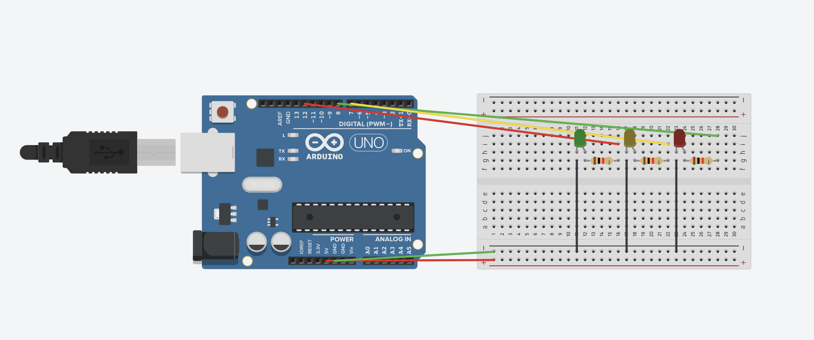

## Irvin's Journal

Monday 11/4
------------------

### Tasks done
* Introduction to the context of the problem
* Created repository
* Introduction to arduino & tinkercad.com

### To-Do list
* Understand how LCD screens work in arduino
* Develop program where users can choose letters from the alphabet with two buttons

### What I learned
* Basics of C
* Arduino wiring
* How to use tinkercard


Thursday 11/7
------------------

### Tasks done
* Comparing and evaluating C vs Bash

**Bash** is very useful for just running repetitive tasks from the terminal, however, it's syntax is sometimes confusing, creating small yet irrelevant mistakes


**C** is very portable between hardware and software, and it is proved to be a more stable language compared to others since it is an industry standard language. However, it is not a simple language so it may seem complicated to first timers


Monday 11/11
------------------

### Tasks done
* Built a traffic light

### To-Do list
* Binary theory research

### What I leared
* How to wire arduino
* How to upload code to arduino

Traffic light w/ arduino:



Wednesday 11/13
------------------

### Tasks done
* Created binaty counter for arduino

```.c
int bitA = 13;
int bitB = 12;
int bitC = 11;
int bitD = 10;
int bitE = 9;

void setup()
{
  Serial.begin(9600);
  pinMode(bitA, OUTPUT);
  pinMode(bitB, OUTPUT);
  pinMode(bitC, OUTPUT);
  pinMode(bitD, OUTPUT);
  pinMode(bitE, OUTPUT);
  
  for (int n = 0; n <= 31; n++) {
  	//bit E
    if (n % 2 == 1) {
    	digitalWrite(bitE, HIGH);
  	}else
    {
      digitalWrite(bitE, LOW);
    }
    //bit D 
    if (n % 4 > 1) {
      digitalWrite(bitD, HIGH);
     }else
    {
      digitalWrite(bitD, LOW);
    }
     //bit C
    if (n % 8 > 3) {
      digitalWrite(bitC, HIGH);
    }else
    {
      digitalWrite(bitC, LOW);
    }
     //bit B
    if (n % 16 > 7) {
      digitalWrite(bitB, HIGH);
    }else
    {
      digitalWrite(bitB, LOW);
    }
     //bit A
    if (n % 32 > 15) {
      digitalWrite(bitA, HIGH);
    }else
    {
      digitalWrite(bitA, LOW);
    }
    delay(2000);
  }
}


void loop()
{
  
}
```
The wiring for this problem is:


### To-Do list
* Build a binary counter with the arduino

### What I learned
* Binary theorm
*How to convert integers to binary in C


Tuesday 11/19
------------------

### Tasks done
* Learned about logic gates
* Created expression for various tables of binary inputs and outputs

### To-do list
* Using logic gates to simplify the homework task (converting the table into light outputs)
* Create a visual representation of binary numbers with a 7-segment display

### What I learned
* Theory of logic gates
* Use of logic gates
* How to draw diagrams for logic gates


Wednesday 11/20
------------------

### Tasks done
* Created table for 7-segment number display, both inputs and outputs
* Created a 7-segment display on tinkercad

Code to control the output:
```.c
A = digitalRead(butA);
B = digitalRead(butB);
C = digitalRead(butC);

// Light A
if (B || (C && A) || (!C && !A) ) {
  digitalWrite(outA, HIGH);
} else {
  digitalWrite(outA, LOW);
}

// Light B
if (!A || (!B && !C) || (C && B)) {
  digitalWrite(outB, HIGH);
} else {
  digitalWrite(outB, LOW);
}

// Light C
if (C || (!C && !B) || (A && B)) {
  digitalWrite(outC, HIGH);
} else {
  digitalWrite(outC, LOW);
}
```

Below is the K map table:


### To-Do list
* Build 7 segment display with arduino

### What I learned
* How to apply logic gates in code
* Creating equations of inputs using logic gates


